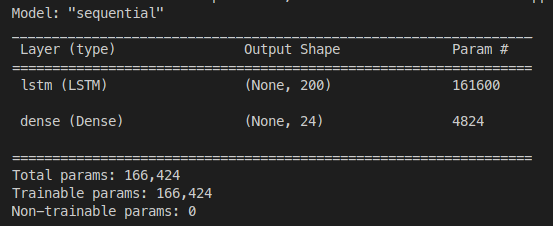
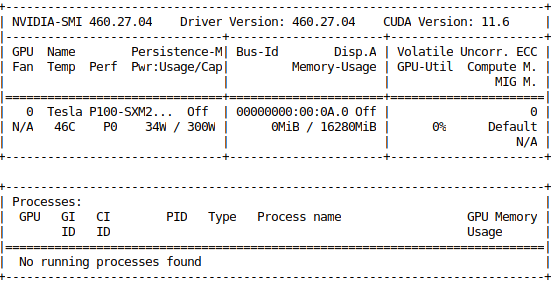

# MLDS-HW2-2022

### Description

### Source

- [Slide](https://docs.google.com/presentation/d/1ihPO_2WvHyrAHinLvGPXRs8jX8ED3Hri/edit?usp=sharing&ouid=112246576290315533201&rtpof=true&sd=true)
- [Dashboard](https://docs.google.com/spreadsheets/d/1Rx6OV64Br8EHrZpbjMa86rm9a8vsngNSjB12s4pO940/edit?usp=sharing)

### Idea

#### :one: Training

- :question: 訓練資料前處理

  - 讀取 training_data 裡面 1~8 月的 csv 檔案

  - 用 glob 的 function 把這八個月的 csv 整合為一個 csv

  - 利用 pandas 來讀取剛剛整合完的 training data csv，**並把 "time" 設為 index**

- :question: 使用什麼模型或方法

  - model  :point_right:  **The Sequential model**

  - layers :point_down: 

    - LSTM

    - Dense (輸出設為 24)

  - model summary:
    - 
  
- :question:  如何訓練模型

  - epoch = 1 :point_right: 使用 cpu 訓練的
  - epoch = **60** :point_right: 使用 **gpu** 訓練的
    - environment
    - 

#### :two: Validation

